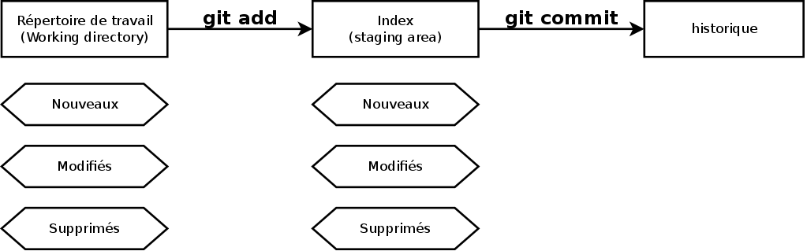

# Commiter en 2 temps

__Ajouter et commiter les modifications__

* **Editer un fichier**: ajouter la partie auteur dans le `README`
* **Ajouter un nouveau fichier**: le fichier `LICSENSE`
* **Editer le fichier index.html**: Ajouter votre nom dans la partie contact
* **git add README.md**: Ajout des modifications du `README` à l'index
  (staging area)
* **git status**: les différents états sont
    * **non suivi**: nouveau fichiers
    * **modifié**: fichiers ayant des modifications du répertoire de travail
      (working directory)
    * **indexé**: l'unité de travail, ce qui est prêt à être commité
* **git commit -m "add author"**: commit les modifications faite dans le fichier
  `README`
* **git add .**: ajoute toutes les modifications du répertoire de travail
* **git commit -m "add LICENSE and contact"**: commit le nouveau fichier
  `LICENSE` et ajout du contact dans index.html

